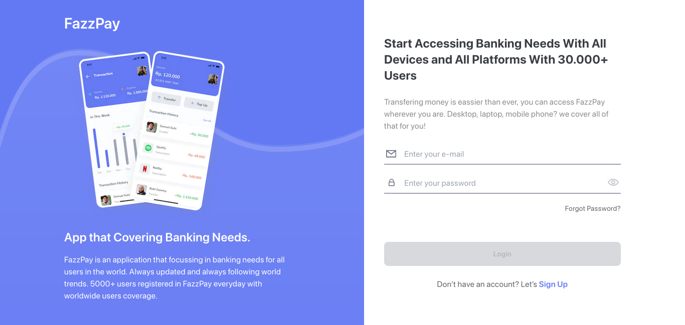
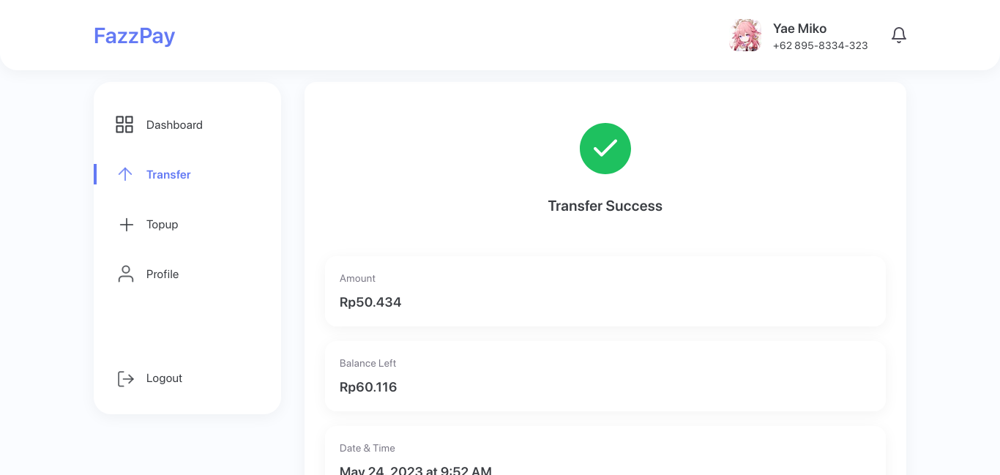
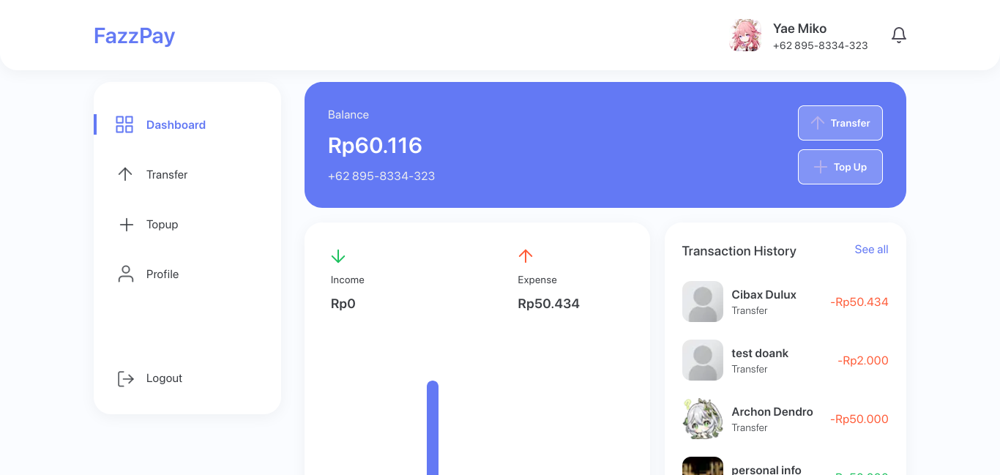

<div align="center">
<br><br>

[](#technologies-used)

<h3 align="center"><b>Fazzpay</b></h3>
   <p align="center">
   Open Source. Front-end.
   </p>

[Demo](https://fazzpay-next-delta.vercel.app/) · [Report Bug](#report-bug) · [Request Feature](#report-bug)

</div>

## Table of Contents

- [Overview](#overview)
  - [Features](#features)
- [Technologies Used](#technologies-used)
- [Getting Started](#getting-started)
  - [Prerequisites](#prerequisites)
  - [Installation](#installation)
- [Screenshots](#screenshots)
- [Resources](#resources)
- [Contributors](#contributors)
- [License](#license)
- [Report Bug](#report-bug)

## Overview

Fazzpay is a complete open-source app simplify financial needs and saving much time in banking needs with one single app.

This is an example application that shows how `fazzpay` is applied to a react app.

Build using create next app.

You can build it by yourself

### Features

- Login, Register, Forgot Password, Logout
- Profile
- Transaction History
- Transfer
- Top-up
- etc.

## Technologies Used

- [Next.js](https://nextjs.org/)
- [Redux](https://redux.js.org/) & [Redux Persist](https://www.npmjs.com/package/redux-persist) (Local Storage)
- [TailwindCSS](https://tailwindcss.com/)
- [DaisyUI](https://daisyui.com/)
- [React Hot Toast](https://react-hot-toast.com/)
- [Awesome Phone Number](https://www.npmjs.com/package/awesome-phonenumber)
- [Vercel](https://vercel.com/) for deploying demo
- etc.

## Getting Started

### Prerequisites

You need to install some software to run this project

- [Node.js](https://nodejs.org/en/download) (LTS version recommended, 14 or newer)

### Installation

1. Clone this repository to your local

   ```bash
   git clone https://github.com/nyannss/fazzpay-next.git
   ```

2. Change current directory

   ```bash
   cd fazzpay-next
   ```

3. Install dependencies

   If you using npm

   ```bash
   npm install
   ```

   If you using yarn

   ```bash
   yarn
   ```

4. Setup environment

   ```env
   NEXT_PUBLIC_APP_SERVER = https://example.com
   NEXT_PUBLIC_FINGERPRINT_NAME = example_storage
   NEXT_PUBLIC_IMAGE_SERVER = https://example.com
   ```

5. Running app

   ```bash
   npm start
   ```

## Screenshots

<div align="center">




</div>
<!--  -->

## Resources

Special thanks for providing resources such as icons and images.

- [Flaticon](https://flaticon.com/)
- [unDraw](https://undraw.co/)
- [SVGRepo](https://svgrepo.com/)
- and other sources.

If there are resources that belong to you, please let me know, I will write it here.

## Contributors

- [nyannss](https://github.com/nyannss)

## License

This project is licensed under the ISC License. See the [LICENSE](LICENSE) file for details.

<!-- 

 -->

## Report Bug

Any error report you can pull request
or contact: <nyannss@proton.me>
